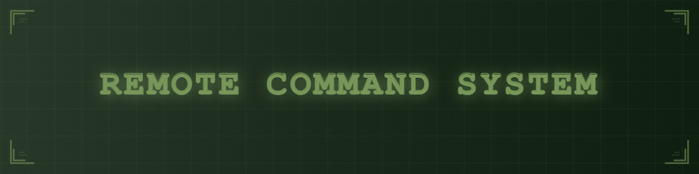

# Remote Command System

A distributed command-and-control platform for team management, built in Go using the actor paradigm.

---

## Overview

Remote Command System streamlines team coordination and task management through a resilient, distributed architecture.  
It provides commanders with full operational visibility while ensuring secure, real-time communication between units.

Key highlights:

- Developed a distributed command-and-control system in Go using the actor paradigm, enabling efficient management of teams with independent, fault-tolerant components.  
- Cross-platform solution: desktop app for commanders (unit/task management, real-time tracking, secure in-app messaging) and mobile app (Flutter) for members (task updates, live location sharing).  
- Integration of both platforms improved coordination, reduced task reporting delays, and ensured fast and reliable communication.  
- Designed an easy-to-manage, secure, and resilient system architecture, where each service operates independently, maintaining reliability even under partial failures.  

---

## Features

- Distributed architecture – services run independently, improving scalability and resilience.  
- Desktop command app – for commanders: unit management, task assignment, real-time monitoring, and secure messaging.  
- Mobile client (Flutter) – for members: task updates, progress reporting, and live location tracking.  
- Real-time monitoring – continuous updates on unit activities and member locations.  
- Secure messaging – encrypted communication with guaranteed data integrity.  
- Fault tolerance – components remain operational even in case of partial system failures.  

---

## Tech Stack

- **Backend:** Go, Actor Paradigm  
- **Frontend:** Custom Desktop GUI, Flutter (Mobile)  
- **Communication:** High-performance messaging system  

---

## Roadmap

- [ ] Advanced analytics dashboard for commanders  
- [ ] Offline-first mobile mode with synchronization  
- [ ] Integration of desktop messaging with mobile client  

---

## License

Copyright (c) 2025 Aleksander

All rights reserved.

This software and associated documentation files (the "Software") are provided for personal and internal use only.  
No part of this Software may be used, copied, modified, merged, published, distributed, sublicensed, or sold,  
in whole or in part, without the express prior written permission of the author.

Unauthorized use of this Software is strictly prohibited.

